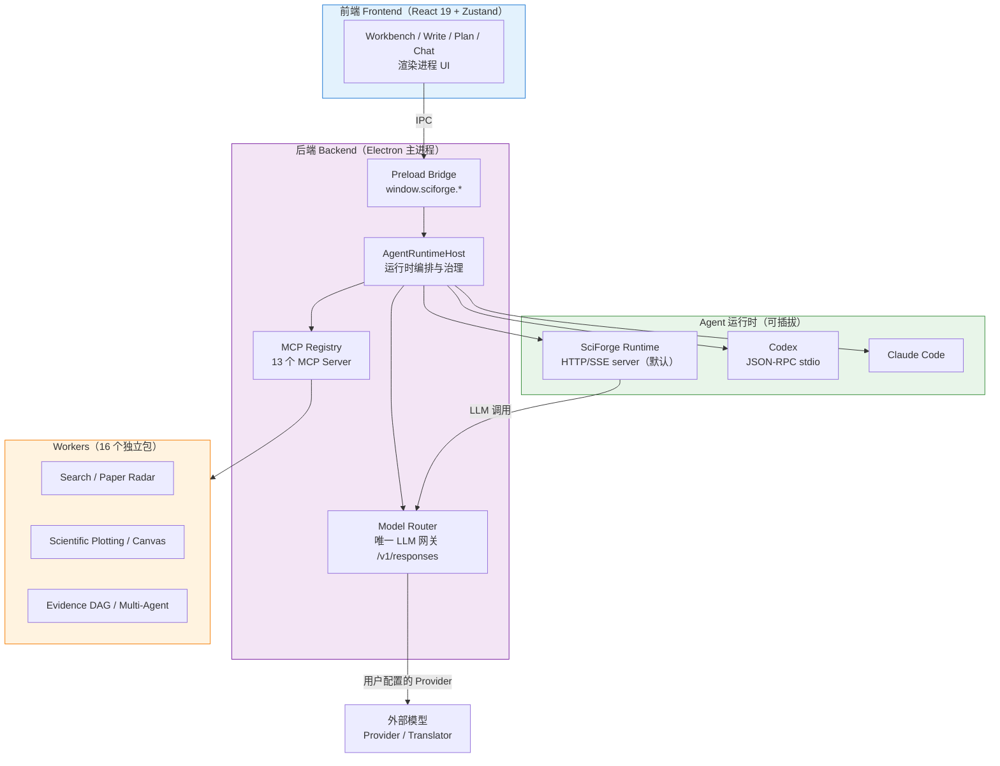
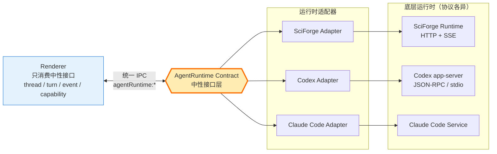
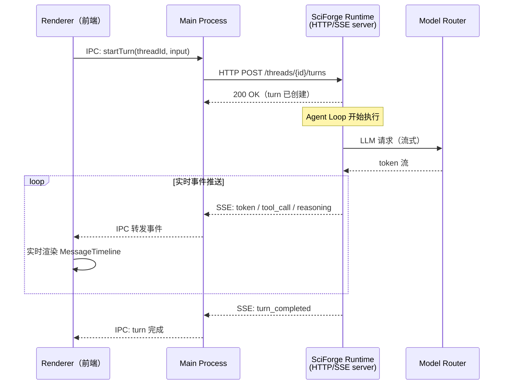
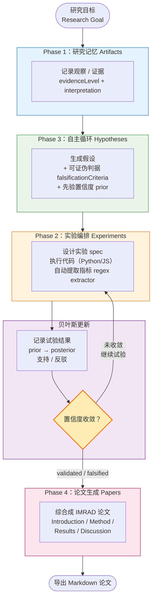
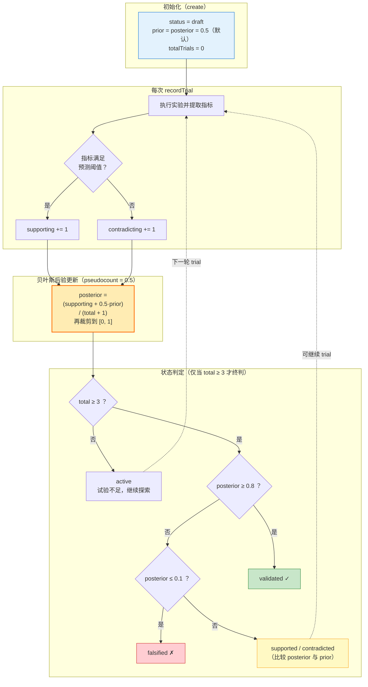

# SciForge 架构图集（Report 配图）

> 本文件包含 5 张关键架构图，使用 Mermaid 语法。
> 在 VS Code（装 "Markdown Preview Mermaid Support" 插件）、GitHub、Typora 中可直接渲染。
> 导出 PNG/SVG：`npx @mermaid-js/mermaid-cli -i ARCHITECTURE-DIAGRAMS.md -o out.png`

---

## 图 1：SciForge 三层整体架构

> 用途：Report「系统复现」章节的开篇图，一眼看清整个平台的分层。



---

## 图 2：中性 AgentRuntime 契约（可插拔运行时）

> 用途：证明你理解了 SciForge 最核心的设计——前端与底层运行时解耦。



---

## 图 3：Runtime HTTP/SSE 通信时序

> 用途：讲清楚你之前问的「Runtime HTTP/SSE server」到底怎么工作。



---

## 图 4：自主科研编排系统 —— 四阶段闭环 ⭐

> 用途：Report 核心章节配图，展示你的原创贡献。这是最重要的一张。



---

## 图 5：假设置信度的贝叶斯更新流程

> 用途：Report 中最有「研究味」的部分，展示方法论深度。
> 公式与阈值均与 `runtime/src/research/hypotheses/store.ts`（update 方法）一致。



> **Report 写作提示（诚实标注，加分项）：**
>
> - 后验用的是带 **pseudocount 平滑的伯努利/Beta 估计**（`pseudocount=0.5`），
>   不是完整的连续贝叶斯推断——这是为了让假设能在少量试验内快速收敛。
> - `falsificationCriteria` 字段是**声明性的**（记录科研意图与证伪标准），
>   但**实际的 falsified 判定由数值阈值 `posterior ≤ 0.1 且 trials ≥ 3` 触发**，
>   两者当前未打通。这是一个诚实的局限，也是很好的「未来工作」点。
> - `total < 3` 时状态一律停在 `active`，这解释了 demo 为何要「额外跑 3 轮加速收敛」。

---

## 使用说明

**查看渲染效果：**

- VS Code：安装插件 "Markdown Preview Mermaid Support"，然后预览此文件
- GitHub：直接推送后在网页查看（原生支持 Mermaid）
- Typora / Obsidian：直接打开

**导出为图片（用于 Word/PPT report）：**

```bash
# 安装 mermaid CLI
npm install -g @mermaid-js/mermaid-cli

# 导出单张图（需先把某张图的 mermaid 代码存成 .mmd 文件）
mmdc -i diagram.mmd -o diagram.png -w 1600 -H 1200
```

**颜色含义：**

- 🔵 蓝色 = 前端 / 输入
- 🟣 紫色 = 后端主进程 / 贝叶斯核心
- 🟢 绿色 = 运行时 / 验证成功
- 🟠 橙色 = Workers / 关键决策点
- 🔴 红/粉 = 论文生成 / 证伪
